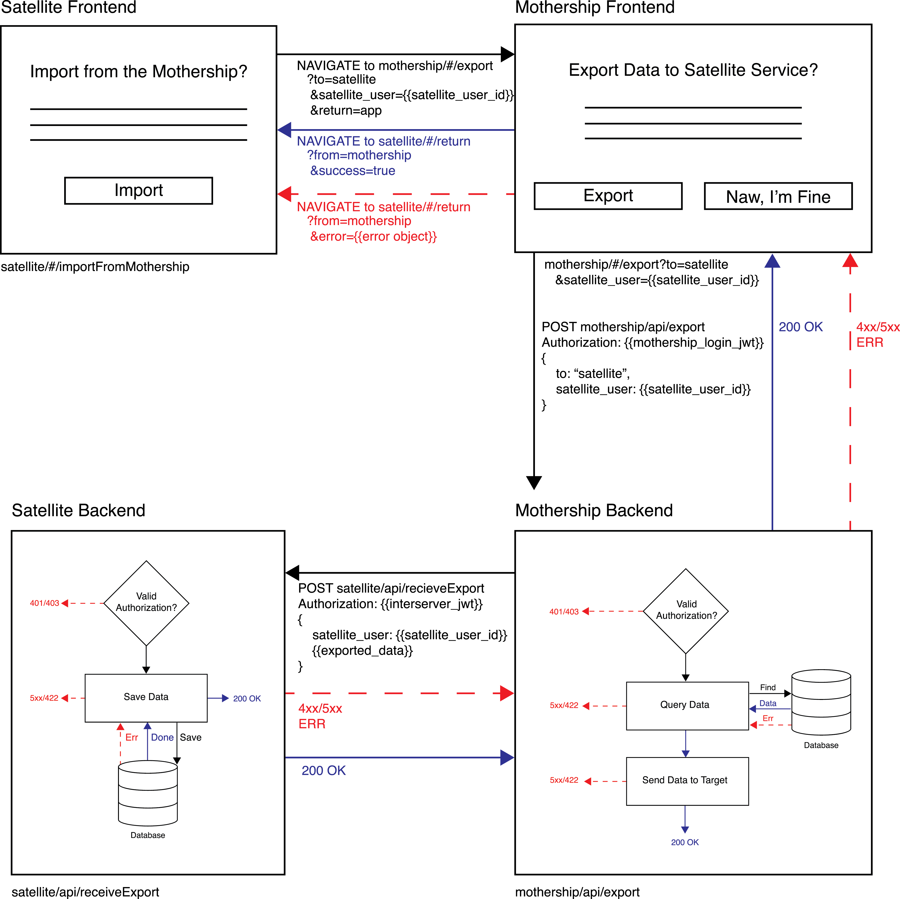

# research-interserver

This repository contains infographics and text related to developing services that exchange data between multiple backends.

### Medium Aritcle ###
[Checkout the Article on Medium](https://medium.com/@jake_billings/anatomy-of-a-cross-service-import-b0e9a48832ef)

### Other Projects ###
Checkout my other projects at [http://www.jakebillings.com](http://www.jakebillings.com) or contact me via [LinkedIn](https://www.linkedin.com/in/jake-billings/).

Checkout my [C++ Blockchain Implementation](https://github.com/jake-billings/research-blockchain).
